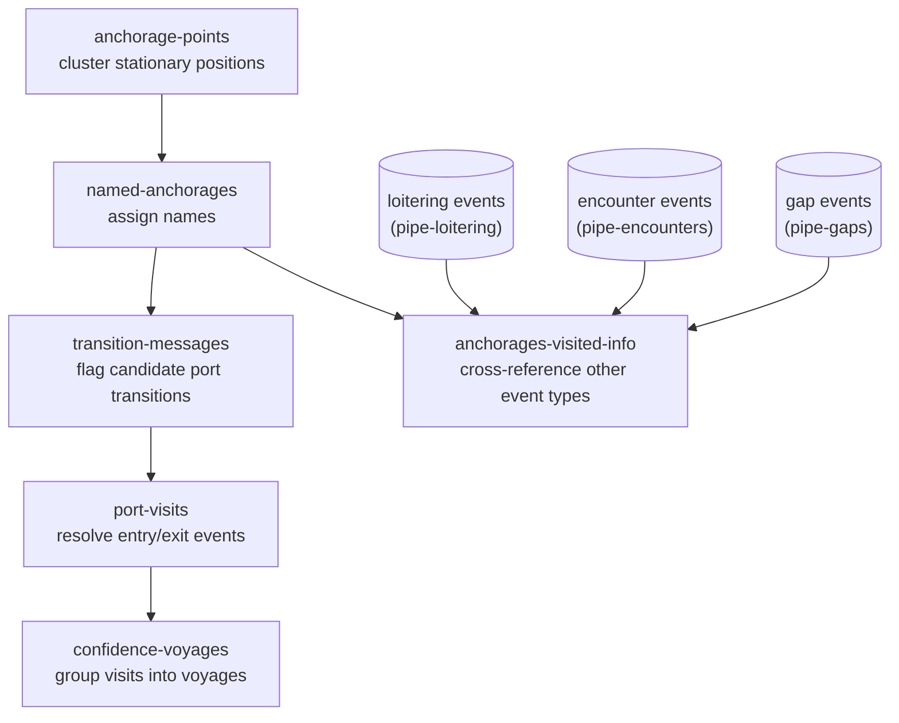

<h1 align="center" style="border-bottom: none;"> pipe-anchorages </h1>

<p align="center">
  <a href="https://codecov.io/gh/GlobalFishingWatch/pipe-anchorages" >
     
  </a>
  <a>
    
  </a>
  <a>
    
  </a>
</p>

Finds where vessels anchor, names those places, and derives the port visits and voyages vessels
make between them -- from vessel position data, AIS or VMS.

[pipe-docs]: https://github.com/GlobalFishingWatch/pipe-docs
[preparing the development environment]: https://github.com/GlobalFishingWatch/pipe-docs/blob/main/CONTRIBUTING.md#preparing-the-development-environment
[git workflow]: https://github.com/GlobalFishingWatch/pipe-docs/blob/main/CONTRIBUTING.md#git-workflow
[gfw-common]: https://github.com/GlobalFishingWatch/gfw-common
[pipe-loitering]: https://github.com/GlobalFishingWatch/pipe-loitering
[pipe-encounters]: https://github.com/GlobalFishingWatch/pipe-encounters
[pipe-gaps]: https://github.com/GlobalFishingWatch/pipe-gaps
[Makefile]: Makefile

**Table of contents**:
- [Introduction](#introduction)
- [How it works](#how-it-works)
- [Development](#development)
- [Usage](#usage)
    * [Using the CLI](#using-the-cli)
    * [Config files](#config-files)
- [References](#references)

## Introduction

<div align="justify">

Global Fishing Watch processes billions of AIS position messages to track vessel activity at
sea. [[1]](#1) A large share of that activity isn't *at* sea at all: vessels spend much of their
time stopped near the coast -- at a port, an anchorage, a transshipment point -- before heading
back out. Knowing *where* those stops happen, *what* that place is called, and *when* a vessel
entered and left it is the basis for a wide range of downstream analysis: port-call statistics,
fishing-access agreements, labor and IUU-fishing risk assessments, and more.

`pipe-anchorages` answers those questions. It clusters stationary vessel positions near the coast
into candidate anchorage points, assigns each one a human-readable name, and then re-walks each
vessel's full track against those named anchorages to detect port-visit entry/exit events and the
voyages between them. The clustering thresholds, naming priority, and entry/exit/stop-speed rules
this repository implements are the same ones GFW publishes as its own methodology for this
dataset. [[2]](#2) [[3]](#3)

The anchorage clustering and naming stages (`anchorage-points`/`named-anchorages`) are run
manually/occasionally, against AIS position data. The port-visit detection chain
(`transition-messages`/`port-visits`/`confidence-voyages`) and `anchorages-visited-info`, though,
run in production *daily* against both AIS and VMS vessel tracks, reusing the same named-anchorages
reference table either way.

</div>

## How it works

<div align="justify">

The pipeline is a chain of five stages, each its own CLI command (see [Usage](#usage)), plus one
side stage that cross-references the results against other GFW pipelines' event data:

</div>



<div align="justify">

- **`anchorage-points`** clusters stationary AIS positions near the coast into candidate anchorage
  points -- a purely behavioral/geometric entity (an S2-cell cluster where enough distinct vessels
  sat still for long enough), independent of any port database. An anchorage exists whether or not
  it's near a known port.
- **`named-anchorages`** assigns each anchorage point a human-readable name, by nearest-match
  lookup against reference port and place gazetteers, with a manually-curated override list
  (corrections, forced removals) taking priority over the automated lookup.
- **`transition-messages`** flags candidate state transitions -- entering/exiting a named anchorage,
  stopping/starting to move within one -- from raw position messages, processed in bounded
  per-segment/per-day windows. Because it only sees one window at a time, it conservatively keeps
  ambiguous boundary records rather than discarding them.
- **`port-visits`** re-processes those candidate transitions against each vessel's *complete* track
  history, resolving the boundary cases `transition-messages` couldn't and assembling the final
  port-visit entry/exit events.
- **`confidence-voyages`** groups consecutive port visits into voyages -- the span between one
  visit's end and the next visit's start -- at a configurable minimum confidence level.
- **`anchorages-visited-info`** is independent of that chain: it cross-references the named
  anchorages dataset against loitering ([pipe-loitering]), encounter ([pipe-encounters]), and
  gap ([pipe-gaps]) events, producing a reference table of boolean presence indicators per
  anchorage.

</div>

## Development

<div align="justify">

This repository follows the conventions documented in [pipe-docs] (GFW's shared documentation hub
for pipeline repositories). First, clone the repository:

</div>

```shell
git clone https://github.com/GlobalFishingWatch/pipe-anchorages.git
```

<div align="justify">

Then see [preparing the development environment] and [git workflow] in [pipe-docs] for the rest --
Docker setup, installing dependencies, pre-commit hooks, and how branches/PRs are managed.

This repository's CLI and Apache Beam pipeline infrastructure are built on [gfw-common].

Once your environment is set up, the [Makefile] in this repository exposes the usual targets:
`make docker-build`, `make docker-shell`, `make test`, `make format`, `make lint`, among others --
run `make help` for the full list. No repository-specific system dependency is required beyond
what [pipe-docs] already covers.

</div>

## Usage

### Using the CLI

<div align="justify">

`pipe-anchorages`'s CLI covers every stage of the pipeline. Run `pipe-anchorages -h` for the
authoritative, up-to-date list, or `pipe-anchorages <command> -h` for a command's own parameters.

</div>

<table>
<tr>
<th width="1%" nowrap>Command</th>
<th>Description</th>
</tr>
<tr>
<td width="1%" nowrap><code>anchorage&#8209;points</code></td>
<td>Clusters stationary vessel positions near the coast into candidate (unnamed) anchorage
points.</td>
</tr>
<tr>
<td width="1%" nowrap><code>named&#8209;anchorages</code></td>
<td>Assigns names to anchorage points, from a reference port/place gazetteer and a manual
override list.</td>
</tr>
<tr>
<td width="1%" nowrap><code>transition&#8209;messages</code></td>
<td>Flags candidate port-related state transitions from raw position messages near named
anchorages.</td>
</tr>
<tr>
<td width="1%" nowrap><code>port&#8209;visits</code></td>
<td>Resolves candidate transitions into final port-visit entry/exit events, using each vessel's
complete track.</td>
</tr>
<tr>
<td width="1%" nowrap><code>confidence&#8209;voyages</code></td>
<td>Groups consecutive port visits into voyages, at a given minimum confidence level.</td>
</tr>
<tr>
<td width="1%" nowrap><code>anchorages&#8209;visited&#8209;info</code></td>
<td>Cross-references named anchorages against loitering/encounter/gap events into a boolean
presence-indicator table.</td>
</tr>
</table>

<div align="justify">

Example:

</div>

```shell
pipe-anchorages anchorage-points \
    --bq-in-messages world-fishing-827.pipe_production_v20201001.position_messages_ \
    --bq-in-segments world-fishing-827.pipe_production_v20201001.segments_ \
    --bq-out-anchorage-points world-fishing-827.scratch_ttl30d.anchorage_points \
    --start-date 2024-01-01 --end-date 2024-01-31 \
    --gcs-in-fishing-ssvids gs://machine-learning-dev-ttl-120d/fishing_mmsi.txt
```

### Config files

<div align="justify">

Besides plain CLI flags, every command also accepts a config file via the built-in `-c`/
`--config-file` flag (YAML or JSON), with CLI flags taking precedence over matching config-file
keys. A runnable example for each command lives under `config/<command-name>/`, e.g.
[config/anchorage-points/bq-1-month.yaml](config/anchorage-points/bq-1-month.yaml) -- use these
as a starting point rather than hand-writing one from scratch.

```shell
pipe-anchorages anchorage-points -c config/anchorage-points/bq-1-month.yaml
```

</div>

## References

<a id="1">[1]</a> Kroodsma, D. A., Mayorga, J., Hochberg, T., Miller, N. A., Boerder, K., Ferretti,
F., Wilson, A., Bergman, B., White, T. D., Block, B. A., Woods, P., Sullivan, B., Costello, C. J.,
Worm, B. (2018). Tracking the global footprint of fisheries. Science, 359(6378), 904-908.
https://doi.org/10.1126/science.aao5646

<a id="2">[2]</a> Global Fishing Watch. Anchorages, Ports and Voyages Data: methodology for
anchorage detection, naming, and port-visit identification.
https://globalfishingwatch.org/datasets-and-code-anchorages/

<a id="3">[3]</a> Global Fishing Watch. Ports and Voyages of Fishing Vessels (research project).
https://globalfishingwatch.org/research-project-ports-and-voyages/

# License

Copyright 2017 Global Fishing Watch

Licensed under the Apache License, Version 2.0 (the "License");
you may not use this file except in compliance with the License.
You may obtain a copy of the License at

    http://www.apache.org/licenses/LICENSE-2.0

Unless required by applicable law or agreed to in writing, software
distributed under the License is distributed on an "AS IS" BASIS,
WITHOUT WARRANTIES OR CONDITIONS OF ANY KIND, either express or implied.
See the License for the specific language governing permissions and
limitations under the License.
